# Proyecto 2 (Base de Datos 2): Motor de búsqueda multimodal

Integrantes:
- Kiara Alexandra Balcázar Santa Cruz
- Jefri Vargas Fernandez
- Jimena Adela Gurbillon Santa Cruz
- Joaquín Emir Salazar Peña

---

## 1. Introducción

Este proyecto implementa un **motor de base de datos multimodal** capaz de indexar
y recuperar texto, imágenes y audio bajo un único paradigma:

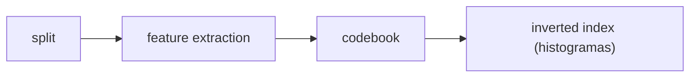

No es una aplicación CRUD: es un engine con capas de storage, buffer, índices,
query processor y una capa de presentación. Todos los índices son estructuras
propias que operan sobre páginas administradas por un `BufferManager` central, y
el sistema se compara experimentalmente contra los índices nativos de PostgreSQL
(GIN para texto, pgvector IVFFlat/HNSW para vectores).

## 2. Requisitos

Lo listado aquí está implementado y es verificable contra el código actual.
Lo único aspiracional se marca como pendiente.

### Funcionales

- **DDL:** `CREATE TABLE` con los tipos `INT`, `FLOAT`, `TEXT`, `VARCHAR`,
  `VECTOR` y `BOOL`, `DROP TABLE`, y `CREATE INDEX ... USING` con los seis
  tipos de índice (`query/parser/grammar.lark`).
- **DML:** `INSERT` multifila con lista de columnas opcional y `DELETE` con
  `WHERE`.
- **SELECT** con proyección de columnas, `LIMIT` y las siete formas de
  predicado de la tabla siguiente.
- **Modalidades:** texto (inverted index + TF-IDF), imagen (SIFT) y audio
  (MFCC por ventana o audio features del CSV), las tres detrás de los mismos
  puertos (`FeatureExtractor`, `Codebook`, `Index`).
- **Planner** que elige el índice según el predicado, y explain del plan
  realmente ejecutado en cada respuesta, con el predicado normalizado y la
  decisión del planner visibles.
- **API y UI:** `POST /query`, `POST /upload`, `GET /files/{name}`,
  `GET /health` y el frontend con editor SQL, galería multimedia, audio
  player y panel de métricas.
- **Comparación** contra los índices nativos de PostgreSQL: GIN para texto y
  pgvector (IVFFlat y HNSW) para vectores.

| Predicado | Forma | Lo resuelve |
|---|---|---|
| Comparación | `id = 5` (también `!=`, `<`, `<=`, `>`, `>=`) | hash extendible, o el índice ya creado sobre la columna |
| Rango | `id BETWEEN 1 AND 9` | B+Tree o ISAM |
| KNN por vector | `KNN(feat, [0.1, 0.2, 0.3], 5)` | MultimediaKNN |
| KNN por archivo | `KNN(img, "query.png", 5)` | MultimediaKNN, previa extracción y cuantización del archivo |
| Espacial | `WITHIN(box, [0, 0], [10, 10])` | R-Tree |
| Texto | `MATCH(lyrics, "términos", 3)` | inverted index (SPIMI + TF-IDF) |
| Híbrido | `HYBRID(cover, "query.png", lyrics, "términos", 3)` | KNN + inverted fusionados por ranking |

### No funcionales

- **RAM acotada:** el buffer LRU retiene como máximo `capacity` páginas (64
  por defecto, `core/buffer/lru_buffer.py`) y SPIMI vuelca sus bloques a
  páginas de 4096 bytes, así que el build de texto no exige el corpus completo
  en memoria.
- **Latencia (medida en la corrida real de benchmarks):** el texto propio
  pasa de 0.24 ms por consulta (N=1000) a 34.9 ms (N=100000) y el KNN propio
  de 0.14 ms a 47.0 ms. En la misma carga de 100K, IVFFlat responde en 2.7 ms
  y HNSW en 4.1 ms. La corrida de 100K chunks está registrada con sus tablas
  y plots en la sección de experimentos.
- **Portabilidad:** `STORAGE_BACKEND=file|postgres` cambia la persistencia sin
  tocar índices ni executor.
- **Observabilidad:** toda respuesta incluye `elapsed_ms`, `disk_reads`,
  `disk_writes`, índice usado y plan, con la definición operacional de cada
  métrica documentada en la sección de métricas.
- **Testabilidad:** cada puerto tiene un contract test parametrizado que corre
  sobre todas sus implementaciones.

## 3. Dataset

- **Texto y audio features:** dataset de canciones entregado por el profesor,
  dos CSV con `track_id`, las letras (lyrics) y doce columnas numéricas: once
  audio features (`danceability`, `energy`, `key`, `loudness`, `mode`,
  `speechiness`, `acousticness`, `instrumentalness`, `liveness`, `valence`,
  `tempo`) más `duration_ms`. Se colocan en `data/` (la carpeta está en
  `.gitignore`, el dataset no se versiona).
- **Imágenes (covers):** carpeta pública de Google Drive del proyecto. El seed
  las descarga con `gdown` (`tests/seed_demo.py`, variable `DRIVE_FOLDER_ID`)
  y `manifest.json` trae artista, título, álbum y letra por cover.
- **Audio real (opcional, FMA small):** 8000 clips mp3 de 30 segundos del
  dataset público FMA, subidos como dos zips a carpetas de Drive del proyecto.
  `tests/download_data.py --only fma` los descarga, verifica el SHA1 oficial
  de cada zip y deja `data/fma/tracks.csv` y `data/fma/audio/`. Después
  `tests/import_demo.py --dataset fma` los importa. El flujo completo de
  descarga e importación está en la sección Cómo correr.
- **Sintético:** cuando no hay data real, el seed genera un PNG y un WAV mínimos
  y los benchmarks generan documentos y vectores deterministas con seed fija.

### Estadísticas

Medidas sobre la copia local de `data/`:

| Estadística | Valor |
|---|---|
| Canciones (mismos `track_id` en letras y features) | 18194 |
| Artistas únicos | 5946 |
| Palabras por letra: mediana / media | 341 / 426.2 |
| Palabras por letra: p25 / p75 / p95 | 235 / 510 / 991 |
| Palabras por letra: mínimo / máximo | 1 / 5509 |
| Corpus total de letras | ~7.75 millones de palabras (39 MB) |
| Audio features | 12 columnas estandarizadas (media ~0, desviación ~1) |
| Covers JPG | 17706 (960 MB) |
| Canciones con cover | 17706 de 18194 (97.3 %) |
| Archivos de audio crudo | 0 descargados por defecto (FMA small opcional: 8000) |

- Los dos CSV cubren exactamente las mismas 18194 canciones: letra, features y
  cover cruzan uno a uno por `track_id`.
- Las columnas numéricas vienen estandarizadas (z-score), incluida
  `duration_ms`, así que la duración real de cada pista no es recuperable
  desde el CSV.
- No hay audio crudo descargado por defecto: la modalidad audio se ejercita
  con las features del CSV y los WAV sintéticos del seed. El flujo opcional
  FMA (`tests/download_data.py --only fma`) agrega 8000 clips mp3 reales.

## 4. Arquitectura

El engine sigue una arquitectura de **DBMS por capas** con puertos hexagonales en
los bordes. Las dependencias fluyen estrictamente hacia abajo:

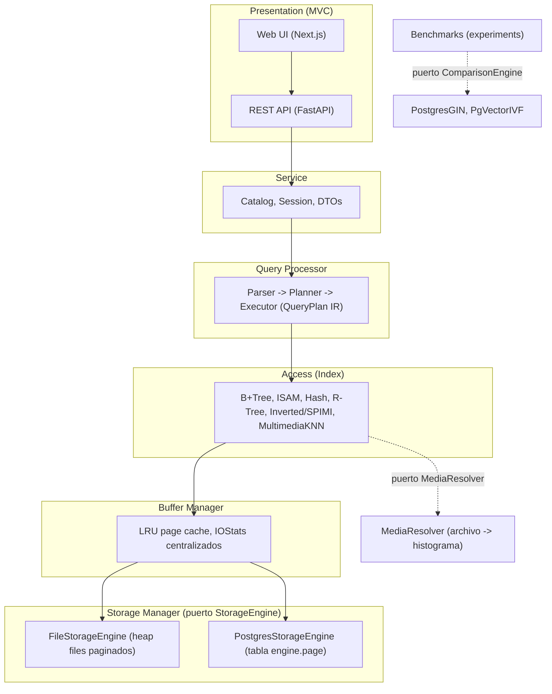

Las flechas sólidas son la regla de dependencia estrictamente hacia abajo:
cada capa solo conoce la interface de la capa inferior. Las flechas punteadas
son los puertos hexagonales driven: `MediaResolver` convierte un nombre de
archivo en histograma para el KNN, y `ComparisonEngine` cuelga de los
benchmarks que comparan contra PostgreSQL, no del executor. El puerto driving
es la API REST que consume la UI.

Cada capa depende solo de la interface (ABC) de la capa inferior, definidas en
`core/ports/`, `multimedia/ports/` y `query/ports.py`. Las implementaciones se
inyectan por constructor y `tests/mocks.py` provee un doble de cada puerto.

### Por qué un BufferManager centralizado

El `BufferManager` es el único componente que llama al `StorageEngine`. Todos los
índices piden páginas con `buffer.get(file_id, page_no)`, y por eso los
contadores `disk_reads` y `disk_writes` se acumulan en un solo lugar: ningún
índice lleva contadores propios ni hace I/O directo (`pickle`, `open()` y
`psycopg2` están prohibidos dentro de los índices). La implementación LRU
(`core/buffer/lru_buffer.py`) soporta `pin`/`unpin` y agrupa el write-back de
páginas sucias al desalojar:

`core/buffer/lru_buffer.py`
```python
    # Escribe las páginas sucias ordenadas por archivo, para no saltar entre archivos
    def _write_back(self, pages: list[Page]) -> None:
        for page in sorted(pages, key=lambda p: (p.file_id, p.page_no)):
            if page.dirty:
                self._storage.write_page(page.file_id, page.page_no, bytes(page.data))
                page.dirty = False
```

El `StorageEngine` tiene dos implementaciones intercambiables sin tocar índices
ni executor: `FileStorageEngine` (heap files paginados con free-list best-fit en
`core/storage/heap_file.py`) y `PostgresStorageEngine` (páginas en la tabla
`engine.page`, `core/storage/postgres_engine.py`). La variable de entorno
`STORAGE_BACKEND` elige cuál usa la API.

### Formato físico

`FileStorageEngine` guarda cada `file_id` en tres archivos: `{file_id}.heap`
con los bytes de las páginas, `{file_id}.dir` con una entrada de largo fijo por
página (offset, capacidad reservada, largo real) y `{file_id}.free` con los
huecos reusables. Si una página crece más allá de su capacidad reservada se
reubica en el hueco best-fit de la free-list o al final del heap. En PostgreSQL
las páginas viven en la tabla `engine.page` (`file_id`, `page_no`, `data BYTEA`)
con `INSERT ... ON CONFLICT DO UPDATE`. Las filas se serializan con
`DynamicRecord` (`core/record.py`): un byte de nulo por campo, formatos `struct`
para los tipos de largo fijo y largo explícito antes del contenido para
`VARCHAR` y `BLOB`.

## 5. Técnicas de indexación

Los seis índices implementan el mismo contrato `Index`
(`build/insert/search/delete` devolviendo `OperationResult` con `IOStats`) y se
validan con un contract test parametrizado único
(`tests/test_index_contract.py`). Resumen de complejidad y criterio de
selección:

| Índice | Estructura | build | search | insert | delete | El planner lo elige para |
|---|---|---|---|---|---|---|
| B+Tree | árbol balanceado, hojas enlazadas | O(n log n) | O(log n), rango O(log n + k) | O(log n) | O(log n) | predicados RANGE / BETWEEN |
| ISAM | páginas primarias estáticas + overflow chains | O(n log n) | O(log n) + cadena | O(1) a overflow | O(páginas candidatas) | alternativa estática por DDL |
| Hash extendible | directorio + buckets con split | O(n) | O(1) esperado | O(1) amortizado | O(1) | predicados de igualdad |
| R-Tree | árbol espacial (librería `rtree`) | O(n log n) | knn y rango espacial O(log n) esperado | O(log n) | por intersección | WITHIN espacial |
| Inverted (SPIMI) | postings por término, TF-IDF coseno | bloques + merge externo | O(términos de la query por sus postings) | O(términos del doc) | O(vocabulario) | búsqueda de texto |
| MultimediaKNN | histogramas + inverted lists por visual word | O(n por words activas) | O(candidatos por dim) | O(words activas) | O(words activas) | predicados KNN |

### B+Tree: split de hoja con claves duplicadas

Las claves duplicadas comparten entrada en la hoja y el split nunca separa un
grupo de claves iguales:

`indices/bplus_tree.py`
```python
    def _leaf_split_position(self, keys: list[Any]) -> int:
        mid = len(keys) // 2
        while mid < len(keys) and keys[mid - 1] == keys[mid]:
            mid += 1
        if mid < len(keys):
            return mid
        mid = len(keys) // 2
        while mid > 1 and keys[mid - 1] == keys[mid]:
            mid -= 1
        return mid
```

### ISAM

Páginas primarias inmutables tras el `build`. Los inserts que no caben van a
overflow pages encadenadas (`indices/isam.py`). La búsqueda de duplicados avanza
a la página siguiente cuando la última clave de una página coincide con la
buscada.

### Hash extendible

Directorio de profundidad global con duplicación y bucket split por profundidad
local (`indices/extendible_hash.py`). La igualdad es O(1) esperado. Un predicado
de rango degrada a un scan ordenado de todos los buckets (limitación declarada).

### R-Tree

Envuelve la librería `rtree` (libspatialindex) detrás del contrato `Index`
(`indices/rtree.py`): soporta rango espacial (`WITHIN`) y k vecinos más cercanos
con reordenamiento por distancia euclidiana real. Es el único índice que no es
implementación propia desde cero, limitación declarada en las conclusiones y
listada como trabajo futuro.

### Inverted index con SPIMI canónico

El builder cierra bloques por cantidad de documentos, los serializa como líneas
JSON y los vuelca a páginas de 4096 bytes vía `BufferManager` (memoria
secundaria). El merge es k-way con heap y streaming: cada bloque se lee página a
página con un carry buffer, nunca entero:

`indices/inverted/spimi_builder.py`
```python
    def merge_blocks(self) -> dict[str, Postings]:
        iterators = [self._iter_block(block_no) for block_no in range(self._total_blocks())]
        heap: list[tuple[str, int, Postings]] = []
        for block_index, iterator in enumerate(iterators):
            first = next(iterator, None)
            if first is not None:
                heapq.heappush(heap, (first[0], block_index, first[1]))
        merged: dict[str, Postings] = {}
        while heap:
            term, block_index, postings = heapq.heappop(heap)
            accumulated = dict(postings)
            self._push_next(heap, iterators, block_index)
            while heap and heap[0][0] == term:
                _, same_block, same_postings = heapq.heappop(heap)
                for doc_id, frequency in same_postings.items():
                    accumulated[doc_id] = accumulated.get(doc_id, 0) + frequency
                self._push_next(heap, iterators, same_block)
            merged[term] = dict(sorted(accumulated.items()))
        return merged
```

El ranking es TF-IDF con similitud de coseno y normas de documento cacheadas
(`indices/inverted/text_index.py`). El preprocesador aplica stopwords y stemming
con NLTK, con un fallback de reglas si NLTK no está disponible
(`indices/inverted/text_preprocessor.py`). Los postings persisten streameados en
páginas de 4096 bytes, no como un blob único.

### MultimediaKNN

Guarda un histograma por objeto y una inverted list por visual word. La búsqueda
filtra candidatos por las visual words activas de la query y solo calcula coseno
contra ese subconjunto. Si el filtro deja muy pocos candidatos, cae a un scan
completo para no perder recall:

`multimedia/knn_index.py`
```python
    def _filter_candidates(self, query: np.ndarray) -> set[str]:
        # Busca las visual words activas en la consulta
        active_words = np.where(query > 0)[0]
        candidates: set[str] = set()
        for word in active_words:
            candidates.update(self._inverted.get(int(word), []))
        # Si hay muy pocos candidatos usa todo el índice
        min_candidates = max(1, int(len(self._vectors) * self._candidate_ratio))
        if len(candidates) < min_candidates:
            return set()
        return candidates
```

### Selección de índice por el planner

El planner mapea el tipo de predicado al índice
(`query/planner.py`: igualdad usa hash, rango usa bplus, KNN usa knn, espacial
usa rtree y texto usa inverted). Si el `Catalog` registra que la columna ya tiene un
índice creado, ese índice manda sobre el mapeo por defecto, y el executor
reporta siempre el índice realmente usado en la respuesta.

## 6. Pipeline multimodal

El paradigma se implementa con tres puertos (`FeatureExtractor`, `Codebook`,
`Index`) encadenados por `MultimediaPipeline`
(`multimedia/pipeline.py`): extrae descriptores por archivo, entrena el
codebook, calcula IDF, recuantiza y construye el índice KNN.

- **Imágenes:** `SIFTExtractor` (`multimedia/extractors/sift_extractor.py`)
  obtiene descriptores locales SIFT de 128 dimensiones con un resize guard para
  imágenes grandes.
- **Audio:** dos extractores. `MFCCExtractor`
  (`multimedia/extractors/mfcc_extractor.py`) calcula MFCC por ventana
  deslizante con librosa (media y desviación por coeficiente) y es el que la
  API registra para resolver KNN por archivo de audio. `AudioExtractor`
  (`multimedia/extractors/audio_extractor.py`) entrega el vector de once audio
  features por track leído del CSV del dataset.
- **Codebook:** `KMeansCodebook` con `MiniBatchKMeans` aprende los centroides
  (visual words) y cuantiza cada conjunto de descriptores a un histograma TF
  ponderado por IDF y normalizado L2:

`multimedia/codebook/kmeans_codebook.py`
```python
    def quantize(self, descriptors: np.ndarray) -> np.ndarray:
        if not self._fitted:
            raise RuntimeError("Codebook no entrenado")
        if descriptors.shape[0] == 0:
            return np.zeros(self._k, dtype=np.float32)
        # Asigna cada descriptor al centroide más cercano
        labels = self._kmeans.predict(descriptors)
        # Genera el histograma de frecuencias normalizado
        histogram, _ = np.histogram(labels, bins=self._k, range=(0, self._k))
        total = histogram.sum()
        tf = (histogram / total).astype(np.float32) if total > 0 else histogram.astype(np.float32)
        # Pondera por IDF para reducir el peso de visual words comunes
        weighted = tf * self._idf
        norm = np.linalg.norm(weighted)
        if norm > 0:
            return (weighted / norm).astype(np.float32)
        return weighted
```

El codebook y el índice KNN persisten a través del puerto `StorageEngine`
(páginas `codebook` y `knn_index`), de modo que con `STORAGE_BACKEND=postgres`
quedan guardados dentro de PostgreSQL en el schema `engine`.

## 7. SQL soportado

La gramática vive en `query/parser/grammar.lark` (lark, parser earley). Además
del DDL y DML clásicos, define predicados multimedia:

`query/parser/grammar.lark`
```
// Busca los k más parecidos a un vector o a un archivo
knn_predicate: "KNN"i "(" NAME "," knn_query "," INT ")"
?knn_query: vector
          | ESCAPED_STRING -> knn_file

// Busca dentro de una caja entre dos esquinas
spatial_predicate: "WITHIN"i "(" NAME "," vector "," vector ")"
```

Ejemplos ejecutables (los mismos snippets del frontend):

```sql
CREATE TABLE img (id INT, path TEXT, feat VECTOR, box VECTOR)
CREATE INDEX ON img (feat) USING knn
CREATE INDEX ON img (box) USING rtree
INSERT INTO img (id, path) VALUES (1, "a.jpg")
DELETE FROM img WHERE id = 5
SELECT * FROM img WHERE id BETWEEN 1 AND 9 LIMIT 10
SELECT * FROM img WHERE KNN(feat, [0.1, 0.2, 0.3], 5)
SELECT * FROM img WHERE WITHIN(box, [0, 0], [10, 10])
```

Tipos de índice aceptados en `CREATE INDEX ... USING`: `bplus`, `isam`, `hash`,
`rtree`, `inverted`, `knn`.

`CREATE INDEX` acepta una cláusula opcional `WITH (clave = valor, ...)` para
configurar el índice. El índice `inverted` entiende `vocabulary`, un entero
positivo que limita el diccionario a las k palabras más frecuentes de la
colección (los términos fuera del top-k no se indexan para búsqueda):

```sql
CREATE INDEX ON songs (lyrics) USING inverted WITH (vocabulary = 500)
```

## 8. Query plan

Cada respuesta de `POST /query` incluye el plan ejecutado como líneas con
sangría (`query/explain.py`), visible en el inspector colapsable del frontend.
Output real del engine para un rango sobre un B+Tree:

```
Index Range Scan using bplus on img  (actual time=0.019 ms  rows=2  reads=0  writes=0)
  Index Cond: id >= 1 AND id <= 2
  Planner: predicado RANGE usa índice bplus
```

Cómo leerlo: la primera línea dice la operación, el índice realmente usado, la
tabla y las métricas reales (tiempo, filas, `disk_reads`/`disk_writes` medidos
como delta de los contadores del storage durante la consulta). `Index Cond`
muestra el predicado normalizado y la línea `Planner` explica la decisión.
Cuando la página ya está en el buffer LRU, `reads` vale 0: la métrica refleja
I/O físico, no accesos lógicos.

## 9. Aplicaciones implementadas

El enunciado pide implementar al menos dos de las aplicaciones sugeridas. Este
engine implementa la **Idea 2: Búsqueda Musical Inteligente** (modalidad
primaria: audio + texto) y la **Idea 4: Recomendación Multimodal** (modalidad
primaria: imagen + descripción), ambas sobre el dataset de canciones: 18194
letras con audio features y 17706 covers.

### Idea 2: Búsqueda Musical Inteligente

En un catálogo musical el usuario rara vez conoce el título exacto: recuerda un
fragmento de la letra, o quiere algo que suene parecido a una pista que ya
tiene. La búsqueda por metadata (título, artista, género) no cubre ninguno de
los dos casos, y sobre un corpus de 18194 canciones (~7.75 millones de
palabras) un scan lineal por cada consulta tampoco es viable. El full-text
con TF-IDF resuelve el primer caso: el inverted index recupera en milisegundos
las canciones donde los términos recordados pesan más, aunque esos términos
aparezcan en miles de letras distintas.

El segundo caso es la búsqueda por similitud acústica (query by example): dos
pistas se consideran parecidas por sus descriptores de audio cuantizados a
histogramas contra un codebook compartido, sin etiquetado manual. Eso habilita
el descubrimiento típico de un servicio musical: encontrar covers, versiones y
canciones del mismo estilo partiendo de un archivo de audio, algo que las
etiquetas de género (gruesas e inconsistentes entre catálogos) no permiten con
esa granularidad.

Flujo de uso, con los mismos comandos que ejecuta `tests/seed_demo.py`:

```sql
CREATE TABLE songs (id INT, title TEXT, lyrics TEXT)
CREATE INDEX ON songs (lyrics) USING inverted
INSERT INTO songs (id, title, lyrics) VALUES (1, "Pangarap", "Minsan pa ...")
SELECT * FROM songs WHERE MATCH(lyrics, "corazón noche", 3)
SELECT * FROM tracks WHERE KNN(audio, "demo_query.wav", 3)
```

Respuesta esperada: `MATCH` devuelve las 3 letras con mayor similitud de coseno
TF-IDF. `KNN` por archivo pasa el WAV por el `MediaResolver` (extrae MFCC,
cuantiza contra el codebook y arma el histograma) y devuelve las 3 pistas más
cercanas. En ambos casos la respuesta
trae `index_type`, `predicate_kind`, `elapsed_ms`, los `IOStats` y el plan
ejecutado.

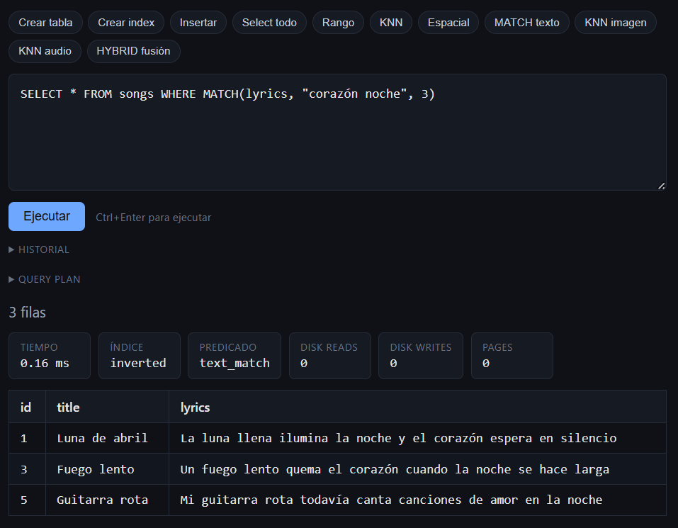

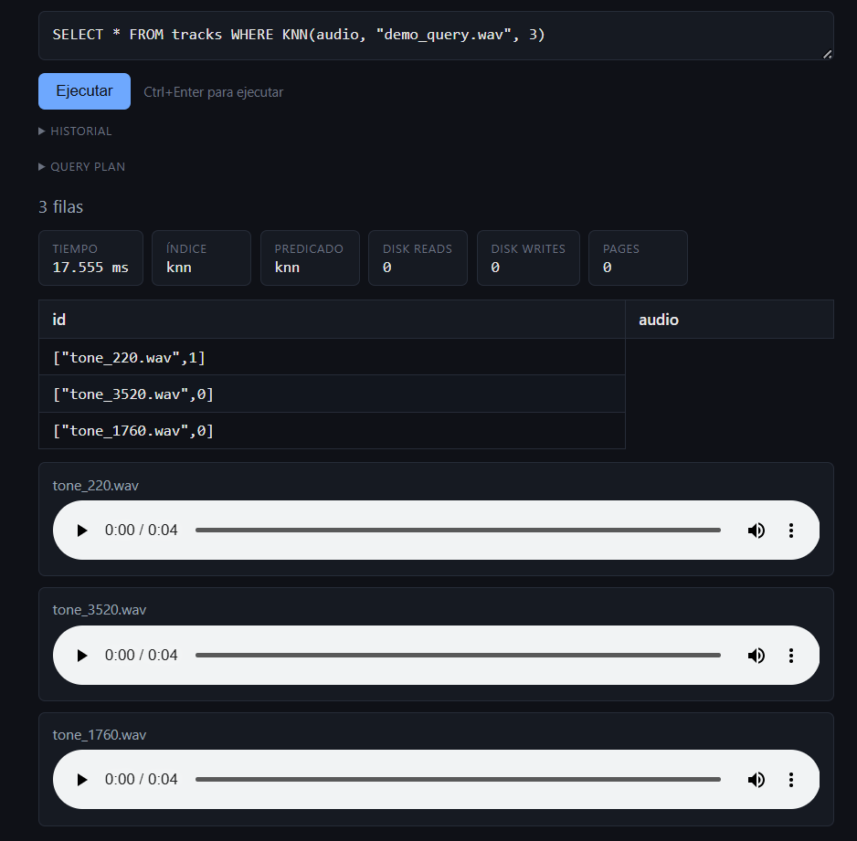

### Idea 4: Recomendación Multimodal

Es la recomendación clásica de catálogo: si te gusta este álbum, cuáles otros
podrían gustarte. El cover codifica género, época y estética visual, y la letra
captura la temática. Una sola modalidad falla en direcciones opuestas: dos
covers minimalistas pueden envolver músicas que no se parecen en nada, y dos
letras con vocabulario común pueden sonar a géneros distintos. Combinar ambas
señales reduce esos falsos positivos y produce recomendaciones más robustas que
cualquiera de las dos modalidades por separado.

La fusión se hace por posición con Reciprocal Rank Fusion (`query/fusion.py`)
porque los scores de las dos modalidades no son comparables entre sí (coseno
sobre histogramas de SIFT contra coseno TF-IDF): fusionar por ranking evita
calibrar escalas. Además cada fila de la respuesta expone `fused_score`,
`visual_score` y `text_score`, de modo que la recomendación es explicable: se
ve si un álbum entró al top por parecido visual, textual o por ambos. Sobre un
catálogo de 17706 covers, esa transparencia es lo que permite auditar los
resultados.

Flujo de uso, también tomado del seed (el valor de `cover` es el nombre del
archivo ya subido por `POST /upload`):

```sql
CREATE TABLE albums (id INT, cover VECTOR, lyrics TEXT)
CREATE INDEX ON albums (cover) USING knn
CREATE INDEX ON albums (lyrics) USING inverted
INSERT INTO albums (id, cover, lyrics) VALUES (1, "5fgHQws1Cj6KDLQmlqM6lF.jpg", "letra ...")
SELECT * FROM albums WHERE HYBRID(cover, "demo_query.png", lyrics, "fuego corazón", 3)
```

Respuesta esperada: el executor pide el triple de k candidatos a cada índice,
fusiona los dos rankings y devuelve las filas con tres columnas extra
(`fused_score`, `visual_score`, `text_score`). El plan reporta
`Hybrid Fusion Scan`. La
variante puramente visual también funciona:
`SELECT * FROM photos WHERE KNN(img, "demo_query.png", 5)`.

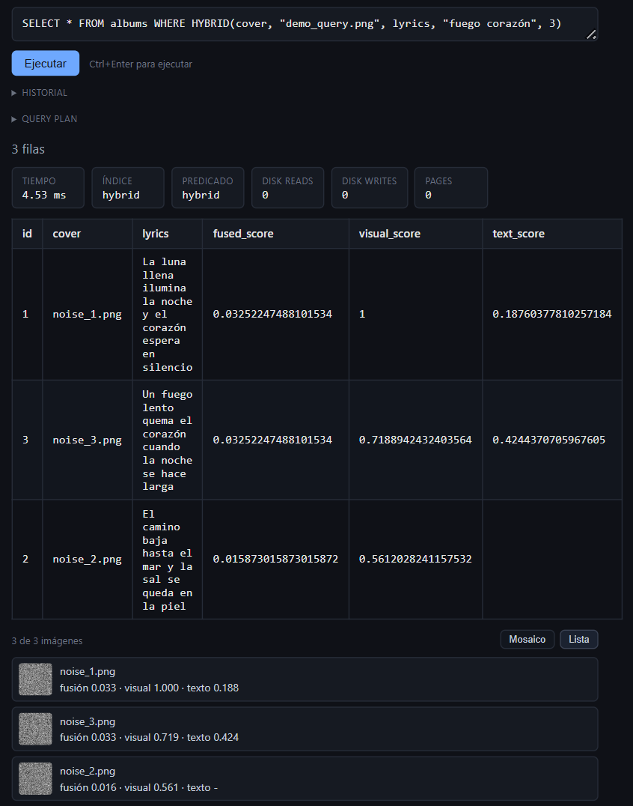

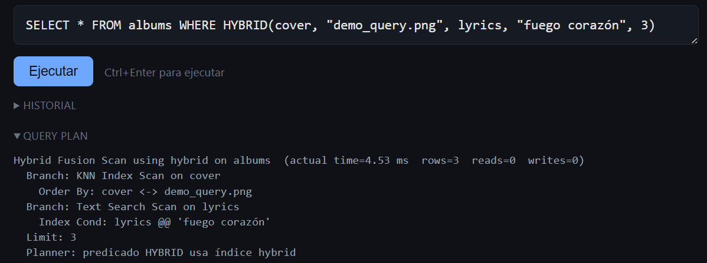

## 10. Cómo correr

Hay dos formas: todo en Docker o cada parte en local.

### Con Docker

Levanta postgres (pgvector), backend y frontend con un solo comando desde la
raíz del repo:

```bash
docker compose up --build
```

Quedan expuestos:
- Frontend: `http://localhost:3000`
- Backend: `http://localhost:8000` (health en `/health`)
- Postgres: `localhost:5432`

Variables opcionales (con sus valores por defecto):
- `STORAGE_BACKEND=file`: elige el `StorageEngine` (`file` o `postgres`).
- `POSTGRES_USER=mmdb`, `POSTGRES_PASSWORD=mmdb`, `POSTGRES_DB=multimodal`.

Para apagar todo:

```bash
docker compose down
```

Para borrar también la data de postgres:

```bash
docker compose down -v
```

Nota: los scripts de `docker/postgres/init.sql` corren solo cuando el volumen
`pg-data` arranca vacío. Si `init.sql` cambió después de la primera corrida,
re-aplicarlo (es idempotente) sin borrar datos:

```bash
docker compose exec -T postgres psql -U mmdb -d multimodal < docker/postgres/init.sql
```

### En local

Backend (Python 3.12) desde la raíz del repo:

```bash
python3 -m venv .venv
source .venv/bin/activate
pip install -r requirements.txt
```

Las dependencias están fijadas en `requirements.txt`. El backend se levanta
desde `multimodal-db/`:

```bash
cd multimodal-db
PYTHONPATH=. uvicorn api.main:app --reload --port 8000
```

Frontend en otra terminal:

```bash
cd multimodal-db/frontend
npm install
npm run dev
```

El frontend lee la URL del backend de `NEXT_PUBLIC_API_URL` y por defecto
apunta a `http://localhost:8000`.

### Población de data (seed)

El seed `multimodal-db/tests/seed_demo.py` crea una tabla `media`, sube los
archivos al endpoint `/upload`, inserta las filas y, si hay imágenes reales,
construye el índice KNN multimedia y muestra una búsqueda de ejemplo. Necesita
el backend corriendo y usa `API_URL` (por defecto `http://localhost:8000`).

Tiene tres fuentes de imágenes, en orden de prioridad:

Carpeta local (prioridad más alta), apuntada con `SEED_IMAGES_DIR`:

```bash
cd multimodal-db
SEED_IMAGES_DIR=/ruta/a/imagenes PYTHONPATH=. python tests/seed_demo.py
```

Data del Drive. Baja la carpeta pública de covers del proyecto con `gdown`:

```bash
cd multimodal-db
USE_DRIVE=1 PYTHONPATH=. python tests/seed_demo.py
```

- `DRIVE_FOLDER_ID`: id de la carpeta de Drive (trae el de covers por defecto).
- `DRIVE_CACHE_DIR`: dónde quedan las imágenes bajadas.

Data sintética (por defecto, sin configurar nada). Sube un PNG de 1x1 y un WAV
corto para probar la galería y el audio player:

```bash
cd multimodal-db
PYTHONPATH=. python tests/seed_demo.py
```

### Importación de datasets completos

El seed puebla una demo chica a través de la API. Para cargar datasets enteros
sin levantar el backend están `tests/download_data.py` (descarga desde Drive)
y `tests/import_demo.py` (crea la tabla, inserta por lotes y construye los
índices con `DatasetImporter`, todo in-process):

```bash
cd multimodal-db
# dataset de canciones: lyrics, songs, covers y sus json
PYTHONPATH=. python tests/download_data.py
PYTHONPATH=. python tests/import_demo.py --dataset spotify --limit 200

# audio real FMA small (7.2 GiB, requiere ~15 GiB libres durante la extracción)
PYTHONPATH=. python tests/download_data.py --only fma
PYTHONPATH=. python tests/import_demo.py --dataset fma --limit 200
```

La descarga de FMA baja los dos zips oficiales desde las carpetas de Drive del
proyecto, verifica el SHA1 publicado de cada uno y deja `data/fma/tracks.csv`
más `data/fma/audio/` con la estructura de subcarpetas que espera `FMALoader`.

Cómo elegir camino:

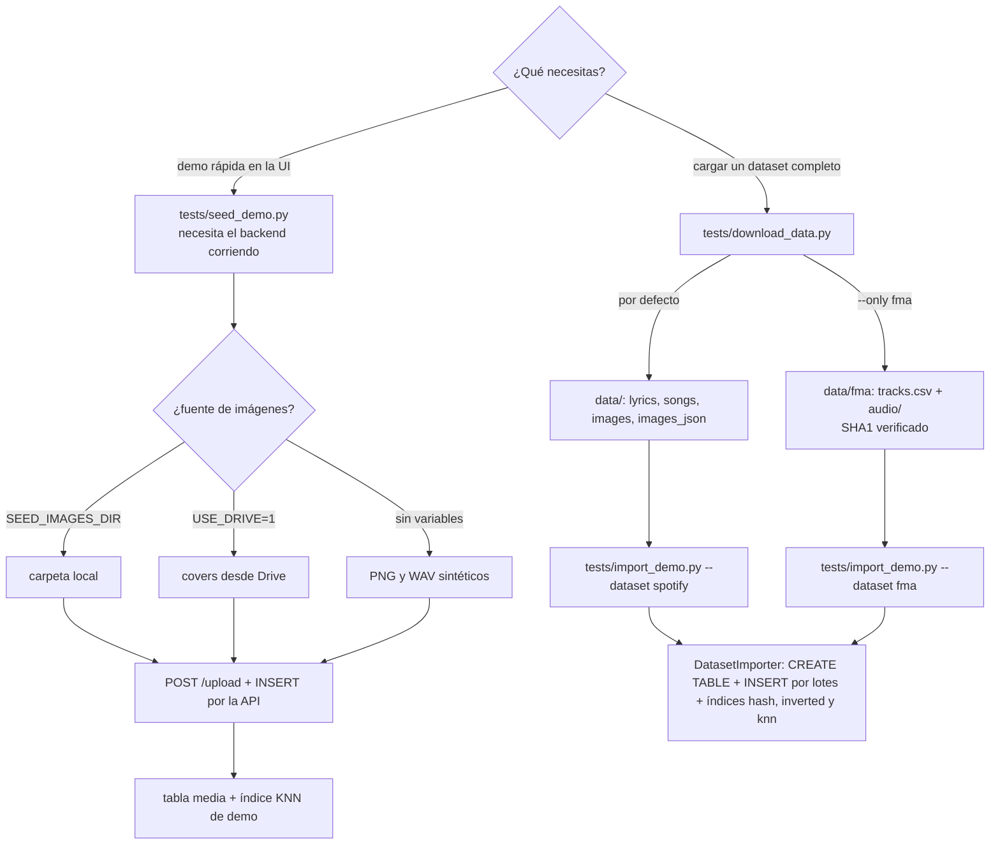

### Pruebas

```bash
cd multimodal-db
pytest tests/
```

La suite incluye contract tests parametrizados por puerto (storage, buffer,
índices, extractores, codebook), unit tests del query processor y un smoke de
integración que va del SQL al índice real y de ahí al storage. Los cuatro
tests de integración contra
PostgreSQL se saltan solos si no hay un servidor disponible.

## 11. Métricas

Definición operacional de cada métrica y dónde se mide:

- **Latencia:** tiempo de pared por consulta, medido con `time.perf_counter()`
  alrededor del dispatch en `Executor.execute` (`query/executor.py`). Viaja
  como `elapsed_ms` en la respuesta de `POST /query` hasta el panel de la UI.
  En los benchmarks se reporta el promedio sobre las consultas de la corrida
  (`--queries`, 10 por defecto).
- **Throughput:** consultas por segundo, medido como tiempo de pared del lote
  completo de consultas dividido entre su cantidad. Se reporta en la columna
  `throughput_qps` de `results.csv` para todos los engines.
- **Recall@k:** fracción del top-k exhaustivo que el índice recupera: los k
  resultados del índice que también están en los k de fuerza bruta, dividido
  entre k, con el scan lineal exacto (coseno con numpy contra toda la
  colección) como ground truth. El benchmark lo mide automáticamente para el
  KNN propio, IVFFlat y HNSW (columna `recall_at_k`). El diseño lo resguarda:
  `MultimediaKNN` cae a scan completo cuando el filtro por visual words deja
  pocos candidatos, garantizando resultados exactos a costa de latencia.
- **Overlap textual:** similitud de Jaccard promedio entre el top-k del
  inverted index propio y el top-k de GIN con `ts_rank` para las mismas
  consultas (columna `overlap_at_k`). No hay ground truth neutral en texto
  porque cada motor usa su propio preprocesamiento, así que se reporta el
  acuerdo entre ambos.
- **Memoria:** dos mediciones además de la cota estructural (el buffer LRU
  retiene a lo más `capacity` páginas y SPIMI vuelca bloques a páginas de 4096
  bytes): el pico de RSS del proceso del benchmark vía
  `resource.getrusage` (columna `rss_mb`) y el tamaño de cada índice nativo de
  PostgreSQL vía `pg_relation_size` (columna `pg_index_mb`).
- **I/O:** `disk_reads`, `disk_writes` y `pages_allocated` (`IOStats` en
  `core/metrics.py`), contados únicamente cuando el storage toca disco bajo el
  `BufferManager`. Un hit del buffer LRU no suma. El costo por consulta es el
  delta de los contadores del storage antes y después de ejecutar, y llega a
  la respuesta y al explain del query plan.

## 12. Experimentos

### Metodología

`experiments/run_benchmarks.py` usa como corpus de texto las letras reales de
`data/lyrics/lyrics_dataset.csv` (descargadas con `tests/download_data.py`).
Las consultas se arman con palabras tomadas de los propios documentos. El
corpus real tiene 18194 letras (una por chunk: las letras del CSV no traen
saltos de párrafo dobles), así que para la carga de 100K el benchmark completa
los documentos faltantes con muestreo con reemplazo sobre las mismas letras
reales, cada copia con id propio. Con `--synthetic`, o si el CSV no existe,
cae al corpus sintético determinista (seed fija): documentos de 20 palabras
sobre un vocabulario de 500 términos. Los vectores son dispersos de 256
dimensiones normalizados (misma dimensión que la columna `vector(256)` de
`compare.media`).

Para cada tamaño de carga mide tiempo de build, latencia promedio, throughput,
recall@10 contra el scan lineal exacto, overlap textual contra GIN, pico de
RSS del proceso y el I/O real del storage para el engine propio. Con
`POSTGRES_DSN` definido agrega las mediciones contra GIN, pgvector IVFFlat y
pgvector HNSW (más `pg_relation_size` de cada índice nativo). Como la tabla
`compare.media` puede tener dos índices ANN, el benchmark deja activo solo el
índice bajo medición (si ambos existen, el planner de PostgreSQL puede elegir
el otro y la medición dejaría de ser real) y al final restaura el IVFFlat de
`init.sql`.

Las corridas dejan `results.csv` y plots en `experiments/results/local/`
(ignorado por git). Los resultados oficiales de esta sección viven en
`experiments/results/` y solo se regeneran pasando `--out experiments/results`
de forma explícita:

```bash
cd multimodal-db
POSTGRES_DSN="dbname=multimodal user=mmdb password=mmdb host=localhost" \
  python -m experiments.run_benchmarks --sizes 1000 10000 100000 --queries 20 \
  --out experiments/results
```

### Resultados (corrida real contra el stack de Docker)

Corrida con `--sizes 1000 10000 100000 --queries 20`. `recall@10` se mide
contra el scan lineal exacto y `overlap@10` es el Jaccard del top-10 propio
contra GIN, según las definiciones de la sección de métricas. `RSS` es el
pico del proceso completo del benchmark, por eso las dos filas propias del
mismo N comparten valor. `n/a` significa que la métrica no aplica a ese engine.

| Modalidad | Engine | N | build (s) | query prom. (ms) | qps | recall@10 | overlap@10 | disk_reads | disk_writes | RSS (MB) | índice PG (MB) |
|---|---|---|---|---|---|---|---|---|---|---|---|
| texto | own-inverted | 1000 | 2.891 | 0.236 | 4171.39 | n/a | 0.309 | 1173 | 801 | 210.0 | n/a |
| vector | own-knn | 1000 | 0.008 | 0.139 | 7072.44 | 1.000 | n/a | 0 | 0 | 210.0 | n/a |
| texto | pg-gin | 1000 | 0.813 | 1.490 | 658.08 | n/a | n/a | n/a | n/a | n/a | 1.33 |
| vector | pg-ivfflat | 1000 | 0.190 | 0.866 | 1019.57 | 0.200 | n/a | n/a | n/a | n/a | 1.62 |
| vector | pg-hnsw | 1000 | 0.338 | 1.007 | 905.05 | 0.995 | n/a | n/a | n/a | n/a | 1.31 |
| texto | own-inverted | 10000 | 29.628 | 4.020 | 248.34 | n/a | 0.067 | 12834 | 8041 | 385.2 | n/a |
| vector | own-knn | 10000 | 0.076 | 3.372 | 296.08 | 1.000 | n/a | 0 | 0 | 385.2 | n/a |
| texto | pg-gin | 10000 | 8.821 | 4.169 | 238.00 | n/a | n/a | n/a | n/a | n/a | 7.42 |
| vector | pg-ivfflat | 10000 | 2.443 | 0.855 | 1034.72 | 0.225 | n/a | n/a | n/a | n/a | 11.62 |
| vector | pg-hnsw | 10000 | 5.802 | 1.419 | 654.67 | 0.970 | n/a | n/a | n/a | n/a | 13.03 |

#### Carga de 100K chunks

| Modalidad | Engine | N | build (s) | query prom. (ms) | qps | recall@10 | overlap@10 | disk_reads | disk_writes | RSS (MB) | índice PG (MB) |
|---|---|---|---|---|---|---|---|---|---|---|---|
| texto | own-inverted | 100000 | 310.699 | 34.900 | 28.64 | n/a | 0.226 | 130364 | 79829 | 1959.3 | n/a |
| vector | own-knn | 100000 | 1.032 | 47.001 | 21.27 | 1.000 | n/a | 0 | 0 | 1959.3 | n/a |
| texto | pg-gin | 100000 | 95.815 | 38.467 | 25.95 | n/a | n/a | n/a | n/a | n/a | 37.52 |
| vector | pg-ivfflat | 100000 | 15.148 | 2.694 | 338.36 | 0.260 | n/a | n/a | n/a | n/a | 112.06 |
| vector | pg-hnsw | 100000 | 282.946 | 4.117 | 233.07 | 0.815 | n/a | n/a | n/a | n/a | 130.24 |

Los plots cubren los tres tamaños hasta 100K e incluyen la curva de HNSW:

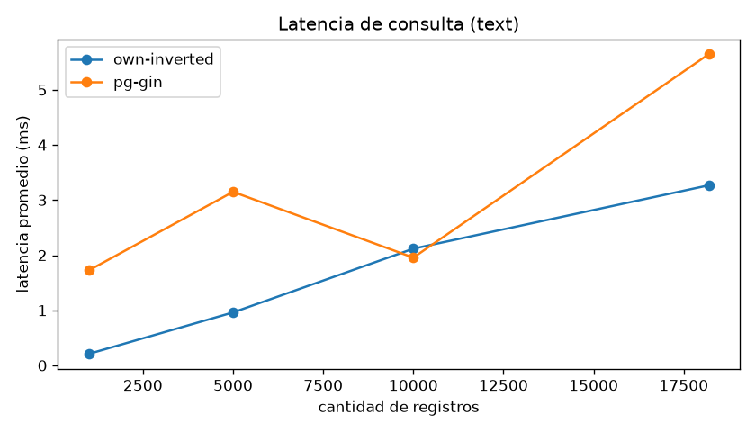

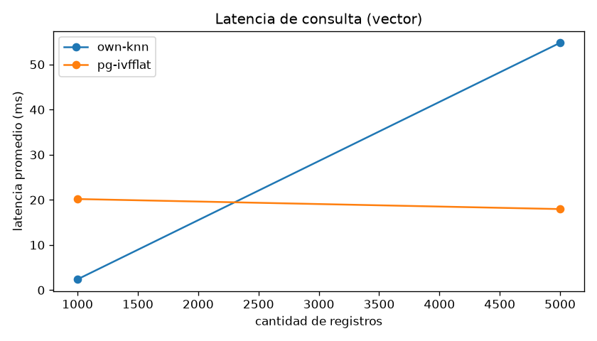

## 13. Comparación contra PostgreSQL

Los adapters implementan el puerto `ComparisonEngine`
(`comparison/ports.py`): `PostgresGINEngine` carga las letras en
`compare.documents` (columna `tsvector` generada + índice GIN) y consulta con
`plainto_tsquery` ordenando por `ts_rank`. `PgVectorIVFEngine` carga los
histogramas en `compare.media` y consulta k vecinos con el operador de distancia
coseno `<=>` sobre IVFFlat, con opción de construir y usar HNSW. Ambos miden
latencia por query y se invocan desde `experiments/run_benchmarks.py`.

Qué se midió y qué se concluye con la corrida de 1K, 10K y 100K chunks:

- **Texto:** la ventaja del inverted index propio se diluye al crecer N. En
  N=1000 responde en 0.236 ms contra 1.490 ms de GIN, en N=10000 ya están
  parejos (4.020 ms contra 4.169 ms) y en N=100000 quedan empatados en la
  práctica: 34.900 ms y 28.64 qps propios contra 38.467 ms y 25.95 qps de
  GIN. El costo oculto del engine propio es la memoria: el proceso llega a un
  pico de 1959.3 MB de RSS en la carga de 100K, mientras el índice GIN ocupa
  37.52 MB dentro del servidor. En build, GIN gana claro: 95.8 s contra
  310.7 s.
- **Vectores:** en N=100000 cada técnica gana una métrica distinta. IVFFlat es
  el más rápido (2.694 ms, 338 qps) y el más barato de construir (15.1 s),
  pero recupera poco (recall 0.260). El KNN propio recupera todo (recall
  1.000) pero su costo crece lineal con N (47.001 ms, 21 qps). HNSW queda en
  el punto medio con 4.117 ms y recall 0.815, pagando el build más caro
  (282.9 s) y el índice más grande (130.24 MB).
- **I/O:** solo el engine propio expone `disk_reads`/`disk_writes` propios. En
  PostgreSQL el I/O queda dentro del servidor y se compara por latencia.

### ¿Se recuperó la misma información?

Es la pregunta explícita de la especificación. Se responde con recall@10
contra el scan lineal exacto (vectores) y con el overlap Jaccard del top-10
contra GIN (texto), sobre las mismas consultas:

- **KNN propio: sí.** Recall 1.000 en los tres tamaños: devuelve exactamente
  el mismo top-10 que la fuerza bruta, porque la poda por visual words cae a
  scan completo cuando no junta candidatos suficientes. El precio es la
  latencia: 47.001 ms por consulta en N=100000.
- **HNSW: casi.** Recall 0.995 (N=1000), 0.970 (N=10000) y 0.815 (N=100000):
  pierde fidelidad al crecer la colección a cambio de latencia casi plana
  (4.117 ms en N=100000).
- **IVFFlat: no.** Recall entre 0.200 y 0.260 con `probes` en su valor por
  defecto (1): explora una sola de las 100 listas y deja fuera unas tres
  cuartas partes del top-10 verdadero. Es el trade-off documentado de IVF:
  subir `probes` sube recall y latencia a la vez.
- **Texto: parcialmente.** Overlap Jaccard de 0.309 (N=1000), 0.067 (N=10000)
  y 0.226 (N=100000). No hay ground truth neutral en texto: el engine propio
  aplica stopwords y stemming de NLTK con ranking TF-IDF coseno, y GIN usa la
  configuración `english` de PostgreSQL con `ts_rank`, así que ambos devuelven
  documentos relevantes para los mismos términos pero no los mismos diez.

En resumen, para N=100000: IVFFlat gana latencia y throughput vectorial,
el KNN propio gana recall, HNSW gana el equilibrio recall-latencia, GIN gana
build y memoria en texto, y la latencia de consulta textual termina pareja
entre el engine propio y GIN.

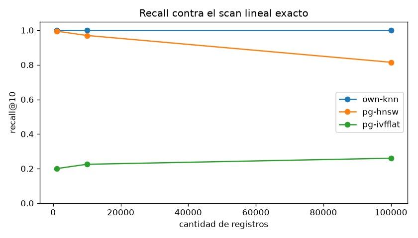

## 14. Capturas de la UI

El frontend (Next.js) incluye editor SQL con Ctrl+Enter y snippets, tabla de
resultados, galería de imágenes con lightbox, audio player, panel de métricas
(IOStats, tiempo, índice usado), historial de consultas e inspector del query
plan.

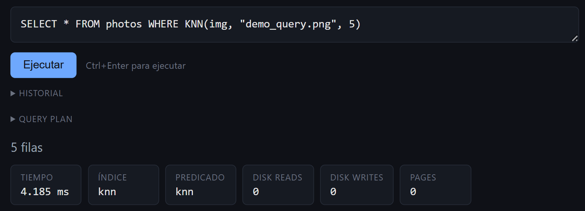

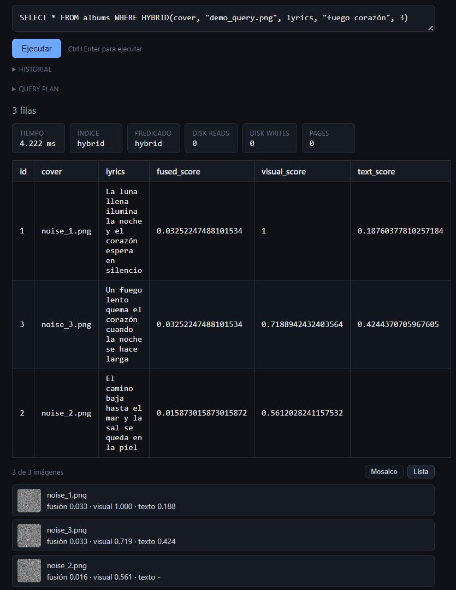

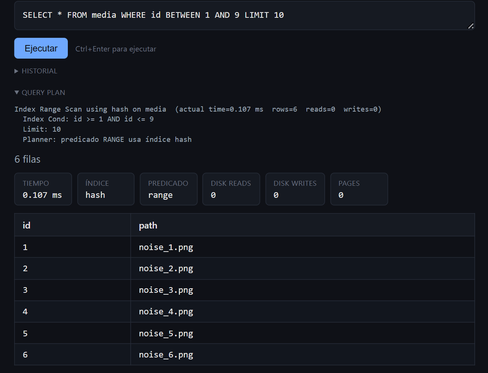

## 15. Conclusiones y trabajo futuro

### Conclusiones

- El paradigma unificado (extractor, codebook, histogramas, inverted index)
  funciona de punta a punta para texto e imágenes, con contratos que permiten
  agregar una modalidad nueva sin tocar el executor.
- Centralizar el I/O en el `BufferManager` hizo trivial medir el costo real por
  consulta: el executor solo calcula el delta de contadores del storage y la
  métrica llega intacta hasta el panel del frontend.
- SPIMI con bloques en memoria secundaria y merge k-way streaming escala más
  allá de la RAM del proceso de build, cumpliendo la forma canónica del
  algoritmo.
- La comparación contra PostgreSQL es reproducible y honesta: en texto el
  engine propio gana con N chico y empata con GIN en 100K pagando mucha más
  memoria, y en vectores gana recall (1.000 contra el scan exacto) pero pierde
  latencia contra IVFFlat y HNSW al crecer N.

### Limitaciones reales detectadas en las auditorías

- **R-Tree no es implementación propia:** envuelve la librería `rtree`
  (libspatialindex). Reescribirlo desde cero con manejo de páginas es la deuda
  principal del criterio de indexación.
- **Audio real solo vía FMA:** el dataset del profesor no trae archivos de
  audio crudo, así que `MFCCExtractor` se ejercita con los WAV sintéticos del
  seed o con el corpus opcional FMA small que descarga
  `tests/download_data.py --only fma`. Las corridas y capturas registradas en
  este README todavía no incluyen esa carga.
- **Sin heap table:** las filas viven solo en los índices. Un `INSERT` sobre una
  tabla sin índice no persiste datos. Falta un heap file de tabla como
  estructura base.
- **Persistencia por snapshot:** B+Tree, ISAM y hash serializan su estado como
  JSON en la página 0 en lugar de mapear nodos a páginas individuales. Los
  postings del inverted index sí se streamean por páginas.
- **Rango sobre hash degrada a scan:** documentado y visible en el explain, pero
  un planner más fino debería rechazarlo o elegir otro índice cuando exista.
- **Corpus de texto amplificado en 100K:** el dataset real tiene 18194 letras,
  así que la carga de 100K repite letras por muestreo con reemplazo. Los
  tiempos de build y el I/O son reales, pero el vocabulario no crece como lo
  haría con 100K letras distintas.

### Trabajo futuro

- **R-Tree propio:** reescribir el índice espacial sobre páginas del
  `BufferManager`, reemplazando la librería `rtree` (la deuda principal de la
  sección anterior).
- **Heap table:** agregar un heap file de tabla con scan por páginas como
  estructura base, para que un `INSERT` sin índice también persista.
- **B+Tree paginado:** mapear nodos a páginas individuales (y hacer lo mismo
  con ISAM y hash) en lugar del snapshot JSON en la página 0.
- **Pesos adaptativos en la fusión híbrida:** el RRF de `query/fusion.py`
  pondera ambas modalidades por igual. Exponer el peso en el SQL o aprenderlo
  por consulta afinaría el ranking de `HYBRID`.
- **Chunking semántico:** el chunker corta por párrafos y las letras del
  dataset llegan como un solo chunk porque no traen saltos de párrafo dobles.
  Cortar por ventanas de tokens o por estrofas habilitaría recuperación a
  nivel de fragmento.
- **Curva recall-latencia de IVFFlat:** repetir la matriz de benchmarks (1K,
  10K y 100K) variando `probes` para mapear el trade-off completo, en vez del
  punto único con el valor por defecto (recall 0.260 en N=100000).
